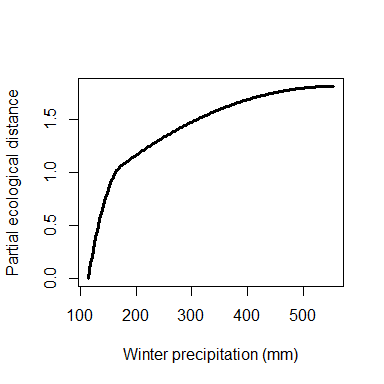
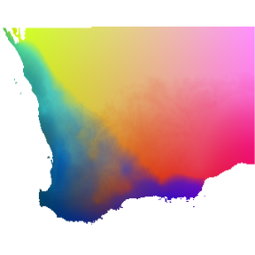

<!-- README.md is generated from README.Rmd. Please edit that file -->

# gdm 

<!-- badges: start -->

[](https://CRAN.R-project.org/package=gdm)
[](https://CRAN.R-project.org/package=gdm)
<!-- badges: end -->

The `gdm` package provides functions to fit, plot, summarize, and apply
Generalized Dissimilarity Models.

# Installation

The **gdm** package is available on CRAN, development versions are
available on GitHub.

-   Install from CRAN:

``` r
install.packages("gdm")
```

-   Install latest development version from GitHub (requires
    [devtools](https://github.com/r-lib/devtools) package):

``` r
if (!require("devtools")) {
  install.packages("devtools")
}
devtools::install_github("fitzLab-AL/gdm")
```

# Package Citation

Fitzpatrick MC, Mokany K, Manion G, Nieto-Lugilde D, Ferrier S. (2021)
gdm: Generalized Dissimilarity Modeling. R package version 1.5.

# Getting Started

GDM has been used in many published studies. In addition to working
through the examples here and those throughout the package
documentation, we recommend reading these publications for background
information:

Ferrier S, Manion G, Elith J, Richardson, K (2007) Using generalized
dissimilarity modelling to analyse and predict patterns of beta
diversity in regional biodiversity assessment. Diversity & Distributions
13: 252-264.

Mokany K, Ware C, Woolley SNC, Ferrier S, Fitzpatrick MC (in revision) A
working guide to generalized dissimilarity modelling.

# Introduction

The R package **gdm** implements Generalized Dissimilarity Modeling
\[@ferrier_2007\] to analyze and map spatial patterns of biodiversity.
GDM models biological variation as a function of environment and
geography using distance matrices – specifically by relating biological
dissimilarity between sites to how much sites differ in their
environmental conditions (environmental distance) and how isolated they
are from one another (geographical distance). Here we demonstrate how to
fit, apply, and interpret GDM in the context of analyzing and mapping
species-level patterns. GDM also can be used to model other biological
levels of organization, notably genetic \[@fitzpatrick_2015\],
phylogenetic \[@rosauer_2014\], or function/traits \[@thomassen_2010\]),
and the approaches for doing so are largely identical to the
species-level case with the exception of using a different biological
dissimilarity metric depending on the type of response variable.

## Preparing the data for GDM: The site-pair table.

The initial step in fitting a generalized dissimilarity model is to
combine the biological and environmental data into “site-pair” table
format using the `formatsitepair` function.

GDM can use several data formats as input. Most common are
site-by-species tables (sites in rows, species across columns) for the
response and site-by-environment tables (sites in rows, predictors
across columns) as the predictors, though distance matrices and rasters
also are accommodated as demonstrated below.

The **gdm** package comes with two example biological data sets and two
example environmental data sets in a number of formats. Example data
include: - `southwest`: A data frame that contains x-y coordinates, 10
columns of predictors (five soil and five bioclimatic variables), and
occurrence data for 900+ species of plants from southwest Australia
(representing a subset of the data used in \[@fitzpatrick_2013\]). Note
that the format of the `southwest` table is an x-y species list (i.e.,
`bioFormat = 2`, see below) where there is one row *per species record
rather than per site*. These biological data are similar to what would
be obtained from online databases such as
\[GBIF\]<https://www.gbif.org/>. - `gdmDissim`: A pairwise biological
dissimilarity matrix derived from the species data provided in
`southwest`. `gdmDissim` is provided to demonstrate how to proceed when
you when you want to fit GDM using an existing biological distance
matrix (e.g., pairwise Fst) as the response variable (i.e.,
`bioFormat = 3`, see below). Note however that distance matrices can
also be used as predictors (e.g., to model compositional variation in
one group as a function of compositional variation in another group
\[@jones_2013\]). - `swBioclims`: a raster stack of the five bioclimatic
predictors provided in the `southwest` data.

Note that for all input data the rows and their order must match in the
biological and environmental data frames and must not include NAs. This
is best accomplished by making sure your tables have a column with a
unique identifier for each site and that the order of these IDs are the
same across all tables.

To build a site-pair table, we need individual tables for the biological
and environmental data, so we first index the `southwest` table to
create a table for the species data and a second for the environmental
data:

``` r
library(gdm)
# have a look at the southwest data set
str(southwest)
#> 'data.frame':    29364 obs. of  14 variables:
#>  $ species   : Factor w/ 974 levels "spp1","spp10",..: 1 1 1 1 1 1 1 1 1 1 ...
#>  $ site      : int  1066 1026 1025 1026 1027 1047 1048 1066 1066 1067 ...
#>  $ awcA      : num  14.5 16.3 23.1 16.3 17 ...
#>  $ phTotal   : num  546 471 460 471 489 ...
#>  $ sandA     : num  71.3 68.9 71.5 68.9 74.7 ...
#>  $ shcA      : num  178.9 105.8 88.4 105.8 147.2 ...
#>  $ solumDepth: num  875 928 892 928 952 ...
#>  $ bio5      : num  31.4 33.1 32.8 33.1 33.2 ...
#>  $ bio6      : num  5.06 4.85 4.82 4.85 4.59 ...
#>  $ bio15     : num  40.4 48.2 53.9 48.2 44 ...
#>  $ bio18     : int  0 0 43 0 0 0 0 0 0 0 ...
#>  $ bio19     : num  133 140 145 140 136 ...
#>  $ Lat       : num  -33 -32 -32 -32 -32.1 ...
#>  $ Long      : num  119 118 118 118 119 ...

# biological data
# get columns with xy, site ID, and species data
sppTab <- southwest[, c("species", "site", "Long", "Lat")]

# # columns 3-7 are soils variables, remainder are climate
# get columns with site ID, env. data, and xy-coordinates
envTab <- southwest[, c(2:ncol(southwest))]
```

Because the `southwest` data is x-y species list format, we use
`bioFormat=2`. Otherwise, we just need to provide the required column
names to create the site-pair table:

``` r
# x-y species list example
gdmTab <- formatsitepair(bioData=sppTab, 
                         bioFormat=2, #x-y spp list
                         XColumn="Long", 
                         YColumn="Lat",
                         sppColumn="species", 
                         siteColumn="site", 
                         predData=envTab)
#> [1] "Site weighting type: Equal"
#> [1] "Site-pair table created with 4371 rows (94 unique sites) and 26 columns (10 environmental variables)."
```

    #>        distance weights s1.xCoord s1.yCoord s2.xCoord s2.yCoord s1.awcA
    #> 132   0.4485981       1   115.057 -29.40472  115.5677 -29.46599 23.0101
    #> 132.1 0.7575758       1   115.057 -29.40472  116.0789 -29.52556 23.0101
    #> 132.2 0.8939394       1   115.057 -29.40472  116.5907 -29.58342 23.0101
    #>       s1.phTotal s1.sandA  s1.shcA s1.solumDepth s1.bio5 s1.bio6 s1.bio15
    #> 132     480.3266 83.99326 477.5656      1129.933  34.668   8.908    86.64
    #> 132.1   480.3266 83.99326 477.5656      1129.933  34.668   8.908    86.64
    #> 132.2   480.3266 83.99326 477.5656      1129.933  34.668   8.908    86.64
    #>       s1.bio18 s1.bio19 s2.awcA s2.phTotal s2.sandA  s2.shcA s2.solumDepth
    #> 132          0   267.44 22.3925   494.1225  76.6900 357.7225     1183.9025
    #> 132.1        0   267.44 17.0975   415.1275  70.0175 112.4800      985.5300
    #> 132.2        0   267.44 17.0300   333.4400  71.5950 165.7250      956.5425
    #>        s2.bio5  s2.bio6 s2.bio15 s2.bio18 s2.bio19
    #> 132   35.50571 7.448572 75.37143        0 228.6572
    #> 132.1 36.05000 6.605882 64.52941        0 168.8824
    #> 132.2 36.18750 6.131250 58.75000        0 141.1250

The first column of a site-pair table contains a biological distance
measure (the default is Bray-Curtis distance though any measure scaled
between 0-1 is acceptable). The second column contains the weight to be
assigned to each data point in model fitting (defaults to 1 if equal
weighting is used, but can be customized by the user or can be scaled to
site richness, see below). The remaining columns are the coordinates and
environmental values at a site (s1) and those at a second site (s2)
making up a site pair. Rows represent individual site-pairs. While the
site-pair table format can produce extremely large data frames and
contain numerous repeat values (because each site appears in numerous
site-pairs), it also allows great flexibility. Most notably, individual
site pairs easily can be excluded from model fitting.

A properly formatted site-pair table will have at least six columns
(distance, weights, s1.xCoord, s1.yCoord, s2.xCoord, s2.yCoord) and some
number more depending on how many predictors are included. See
`?formatsitepair` and `?gdm` for more details.

### Formatting a site-pair table using a distance matrix.

What if you already have a biological distance matrix because you are
working with, say, genetic data? In that case, it is simple as changing
the `bioFormat` argument **and also making sure the rows in your
biological and environmental tables are in the same order**. Let’s have
a quick look at `gdmDissim`, a pairwise biological distance matrix
prodvided with the package:

``` r
# Biological distance matrix example
dim(gdmDissim)
#> [1] 94 94
gdmDissim[1:5, 1:5]
#>          V1        V2        V3        V4        V5
#> 1 0.0000000 0.8181818 1.0000000 0.5000000 0.7500000
#> 2 0.8181818 0.0000000 0.9000000 0.7777778 0.6551724
#> 3 1.0000000 0.9000000 0.0000000 1.0000000 0.5757576
#> 4 0.5000000 0.7777778 1.0000000 0.0000000 0.9090909
#> 5 0.7500000 0.6551724 0.5757576 0.9090909 0.0000000
```

We first need to add a site ID column to `gdmDissim`. We already know
the sites are in the correct order, so we do not check here, but you
should confirm for your data.

``` r
# get the site column from sppTab
site <- unique(sppTab$site)
# bind to gdmDissim
gdmDissim <- cbind(site, gdmDissim)
gdmDissim[1:5, 1:5]
#>   site        V1        V2        V3        V4
#> 1 1066 0.0000000 0.8181818 1.0000000 0.5000000
#> 2 1026 0.8181818 0.0000000 0.9000000 0.7777778
#> 3 1025 1.0000000 0.9000000 0.0000000 1.0000000
#> 4 1027 0.5000000 0.7777778 1.0000000 0.0000000
#> 5 1047 0.7500000 0.6551724 0.5757576 0.9090909
```

Now we are ready to use `formatsitepair`:

``` r
gdmTab.dis <- formatsitepair(bioData=gdmDissim, 
                             bioFormat=3, #diss matrix 
                             XColumn="Long", 
                             YColumn="Lat", 
                             predData=envTab, 
                             siteColumn="site")
#> [1] "Site weighting type: Equal"
#> [1] "Site-pair table created with 4371 rows (94 unique sites) and 26 columns (10 environmental variables)."
```

    #>        distance weights s1.xCoord s1.yCoord s2.xCoord s2.yCoord s1.awcA
    #> 132   0.4485981       1   115.057 -29.40472  115.5677 -29.46599 23.0101
    #> 132.1 0.7575758       1   115.057 -29.40472  116.0789 -29.52556 23.0101
    #> 132.2 0.8939394       1   115.057 -29.40472  116.5907 -29.58342 23.0101
    #>       s1.phTotal s1.sandA  s1.shcA s1.solumDepth s1.bio5 s1.bio6 s1.bio15
    #> 132     480.3266 83.99326 477.5656      1129.933  34.668   8.908    86.64
    #> 132.1   480.3266 83.99326 477.5656      1129.933  34.668   8.908    86.64
    #> 132.2   480.3266 83.99326 477.5656      1129.933  34.668   8.908    86.64
    #>       s1.bio18 s1.bio19 s2.awcA s2.phTotal s2.sandA  s2.shcA s2.solumDepth
    #> 132          0   267.44 22.3925   494.1225  76.6900 357.7225     1183.9025
    #> 132.1        0   267.44 17.0975   415.1275  70.0175 112.4800      985.5300
    #> 132.2        0   267.44 17.0300   333.4400  71.5950 165.7250      956.5425
    #>        s2.bio5  s2.bio6 s2.bio15 s2.bio18 s2.bio19
    #> 132   35.50571 7.448572 75.37143        0 228.6572
    #> 132.1 36.05000 6.605882 64.52941        0 168.8824
    #> 132.2 36.18750 6.131250 58.75000        0 141.1250

In addition to starting with tablular data, environmental data can be
extracted directly from rasters, assuming the x-y coordinates of sites
are provided in either a site-species table (`bioFormat=1`) or as a x-y
species list (`bioFormat=2`).

``` r
# environmental raster data for sw oz
swBioclims <- raster::stack(system.file("./extdata/swBioclims.grd", package="gdm"))

gdmTab.rast <- formatsitepair(bioData=sppTab, 
                              bioFormat=2, # x-y spp list
                              XColumn="Long", 
                              YColumn="Lat", 
                              sppColumn="species",
                              siteColumn="site",
                              predData=swBioclims) #raster stack
#> [1] "Site weighting type: Equal"
#> [1] "Site-pair table created with 4371 rows (94 unique sites) and 16 columns (5 environmental variables)."
```

Because some sites might not overlap with the rasters, we should check
for and remove NA values from the site-pair table:

``` r
sum(is.na(gdmTab.rast))
#> [1] 465
gdmTab.rast <- na.omit(gdmTab.rast)
```

Note that the `formatsitepair` function assumes that the coordinates of
the sites are in the same coordinate system as the rasters. At present,
no checking is performed to ensure this is the case. Note also that if
your site coordinates are longitude-latitude that the calculation of
geographic distances between sites will have errors, the size of which
will depend on the geographic extent and location of your study region.
We hope to deal with this in a later release, but for now you can avoid
these problems by using a projected coordinate system (e.g.,
equidistant).

### Dealing with biases associated with presence-only data

The ideal biological data for fitting a GDM are occurrence records
(presence-absence or abundance) from a network of sites where all
species (from one or more taxonomic groups) have been intensively
sampled such that compositional dissimilarity can be reliably estimated
between sites. However most species data are collected as part of ad hoc
surveys and are presence-only. Under these circumstances, there is no
systematic surveying and no sites per se, but rather grid cells with
some number of occurrence records depending on the number of species
observed, with many grid cells having none, a few, or even a single
species record. When these data are used to calculate compositional
dissimilarity, erroneously high values will result, which will bias the
model.

The `formatsitepair` function provides a few options for dealing with
this potential bias, including (i) weighting sites relative to the
number of species observed (`weightType="richness"`), (ii) removing
sites with few species (e.g., `speciesFilter=10`) or (iii) both.
Decisions regarding which approach to use will depend on the nature of
the data and study system. See Ferrier et al. (2007) for further
discussion.

``` r
# weight by site richness using weightType="richness"
gdmTab.rw <- formatsitepair(bioData=sppTab, 
                            bioFormat=2, 
                            XColumn="Long", 
                            YColumn="Lat",
                            sppColumn="species", 
                            siteColumn="site", 
                            predData=envTab, 
                            weightType="richness")
#> [1] "Site weighting type: Richness"
#> [1] "Site-pair table created with 4371 rows (94 unique sites) and 26 columns (10 environmental variables)."

# weights based on richness (number of species records)
gdmTab.rw[1:5, 1:5]
#>        distance   weights s1.xCoord s1.yCoord s2.xCoord
#> 132   0.4485981 0.2449866   115.057 -29.40472  115.5677
#> 132.1 0.7575758 0.1916207   115.057 -29.40472  116.0789
#> 132.2 0.8939394 0.1635852   115.057 -29.40472  116.5907
#> 132.3 0.9178082 0.1858930   115.057 -29.40472  117.1029
#> 132.4 0.9787234 0.1337957   115.057 -29.40472  117.6156
```

``` r
# remove sites with < 10 species records using
# sppFilter = 10
gdmTab.sf <- formatsitepair(bioData=sppTab, 
                            bioFormat=2, 
                            XColumn="Long", 
                            YColumn="Lat",
                            sppColumn="species", 
                            siteColumn="site", 
                            predData=envTab, 
                            sppFilter=10)
#> [1] "Site weighting type: Equal"
#> [1] "Site-pair table created with 4095 rows (91 unique sites) and 26 columns (10 environmental variables)."
```

## GDM fitting

GDM is a nonlinear extension of permutational matrix regression that
uses flexible splines and generalized linear modeling (GLM) to
accommodate two types of nonlinearity common in ecological datasets: (1)
variation in the rate of compositional turnover (non-stationarity) along
environmental gradients, and (2) the curvilinear relationship between
biological distance and environmental and geographical distance.

The function `gdm` fits generalized dissimilarity models and is simple
to use once the biological and predictor data have been formatted to a
site-pair table. In addition to specifying whether or not the model
should be fit with geographical distance as a predictor variable, the
user has the option to specify (i) the number of I-spline basis
functions (the default is three, with larger values producing more
complex splines) and (ii) the locations of “knots” along the splines
(defaults to 0 (minimum), 50 (median), and 100 (maximum) quantiles when
three I-spline basis functions are used). Even though these option are
available, using the default values for these parameters will work fine
for most applications. In other words, unless you have a good reason,
you should probably use the default settings for splines and knots. The
effects (and significance) of altering the number of splines and knot
locations has not been systematically explored.

Here we fit GDM with geo=T and default settings for all other
parameters.

``` r
gdm.1 <- gdm(data=gdmTab, geo=TRUE)
```

The `summary` function provides an overview of the model, the most
important items to note are:

-   Percent Deviance Explained: goodness-of-fit
-   Intercept: expected dissimilarity between sites that do not differ
    in the predictors
-   Summary of the fitted I-splines for each predictor, including the
    values of the coefficients and their sum. The sum indicates the
    amount of compositional turnover associated with that variable,
    holding all other variables constant. I-spline summaries are order
    by coefficient sum. Variables with all coefficients=0 have no
    relationship with the modeled biological pattern.

``` r
summary(gdm.1)
#> [1] 
#> [1] 
#> [1] GDM Modelling Summary
#> [1] Creation Date:  Wed Dec  8 13:15:12 2021
#> [1] 
#> [1] Name:  gdm.1
#> [1] 
#> [1] Data:  gdmTab
#> [1] 
#> [1] Samples:  4371
#> [1] 
#> [1] Geographical distance used in model fitting?  TRUE
#> [1] 
#> [1] NULL Deviance:  651.914
#> [1] GDM Deviance:  129.025
#> [1] Percent Deviance Explained:  80.208
#> [1] 
#> [1] Intercept:  0.277
#> [1] 
#> [1] PREDICTOR ORDER BY SUM OF I-SPLINE COEFFICIENTS:
#> [1] 
#> [1] Predictor 1: bio19
#> [1] Splines: 3
#> [1] Min Knot: 114.394
#> [1] 50% Knot: 172.416
#> [1] Max Knot: 554.771
#> [1] Coefficient[1]: 0.941
#> [1] Coefficient[2]: 0.868
#> [1] Coefficient[3]: 0
#> [1] Sum of coefficients for bio19: 1.809
#> [1] 
#> [1] Predictor 2: phTotal
#> [1] Splines: 3
#> [1] Min Knot: 277.978
#> [1] 50% Knot: 584.609
#> [1] Max Knot: 1860.37
#> [1] Coefficient[1]: 1.127
#> [1] Coefficient[2]: 0.23
#> [1] Coefficient[3]: 0
#> [1] Sum of coefficients for phTotal: 1.357
#> [1] 
#> [1] Predictor 3: bio5
#> [1] Splines: 3
#> [1] Min Knot: 25.571
#> [1] 50% Knot: 32.16
#> [1] Max Knot: 36.188
#> [1] Coefficient[1]: 0.127
#> [1] Coefficient[2]: 0.453
#> [1] Coefficient[3]: 0.114
#> [1] Sum of coefficients for bio5: 0.694
#> [1] 
#> [1] Predictor 4: solumDepth
#> [1] Splines: 3
#> [1] Min Knot: 705.02
#> [1] 50% Knot: 1017.628
#> [1] Max Knot: 1247.705
#> [1] Coefficient[1]: 0.682
#> [1] Coefficient[2]: 0
#> [1] Coefficient[3]: 0
#> [1] Sum of coefficients for solumDepth: 0.682
#> [1] 
#> [1] Predictor 5: awcA
#> [1] Splines: 3
#> [1] Min Knot: 12.975
#> [1] 50% Knot: 22.186
#> [1] Max Knot: 50.7
#> [1] Coefficient[1]: 0
#> [1] Coefficient[2]: 0
#> [1] Coefficient[3]: 0.523
#> [1] Sum of coefficients for awcA: 0.523
#> [1] 
#> [1] Predictor 6: Geographic
#> [1] Splines: 3
#> [1] Min Knot: 0.452
#> [1] 50% Knot: 2.46
#> [1] Max Knot: 6.532
#> [1] Coefficient[1]: 0.014
#> [1] Coefficient[2]: 0.372
#> [1] Coefficient[3]: 0
#> [1] Sum of coefficients for Geographic: 0.386
#> [1] 
#> [1] Predictor 7: sandA
#> [1] Splines: 3
#> [1] Min Knot: 56.697
#> [1] 50% Knot: 72.951
#> [1] Max Knot: 83.993
#> [1] Coefficient[1]: 0.092
#> [1] Coefficient[2]: 0
#> [1] Coefficient[3]: 0.139
#> [1] Sum of coefficients for sandA: 0.231
#> [1] 
#> [1] Predictor 8: shcA
#> [1] Splines: 3
#> [1] Min Knot: 78.762
#> [1] 50% Knot: 179.351
#> [1] Max Knot: 521.985
#> [1] Coefficient[1]: 0
#> [1] Coefficient[2]: 0.156
#> [1] Coefficient[3]: 0
#> [1] Sum of coefficients for shcA: 0.156
#> [1] 
#> [1] Predictor 9: bio6
#> [1] Splines: 3
#> [1] Min Knot: 4.373
#> [1] 50% Knot: 5.509
#> [1] Max Knot: 9.224
#> [1] Coefficient[1]: 0.121
#> [1] Coefficient[2]: 0
#> [1] Coefficient[3]: 0
#> [1] Sum of coefficients for bio6: 0.121
#> [1] 
#> [1] Predictor 10: bio15
#> [1] Splines: 3
#> [1] Min Knot: 29.167
#> [1] 50% Knot: 55.008
#> [1] Max Knot: 87.143
#> [1] Coefficient[1]: 0.027
#> [1] Coefficient[2]: 0
#> [1] Coefficient[3]: 0
#> [1] Sum of coefficients for bio15: 0.027
#> [1] 
#> [1] Predictor 11: bio18
#> [1] Splines: 3
#> [1] Min Knot: 0
#> [1] 50% Knot: 0
#> [1] Max Knot: 52
#> [1] Coefficient[1]: 0
#> [1] Coefficient[2]: 0
#> [1] Coefficient[3]: 0
#> [1] Sum of coefficients for bio18: 0
```

## GDM plots

The fitted splines represent one of the most informative components of a
fitted GDM and so plotting and scrutinizing the splines is a major part
of interpreting GDM and the analyzed biological patterns. The fitted
model and I-splines can be viewed using the `plot` function, which
produces a multi-panel plot that includes two model summary plots
showing (i) the fitted relationship between predicted ecological
distance and observed compositional dissimilarity and (ii) predicted
versus observed biological distance, followed by a series of panels
showing each I-spline with at least one non-zero coefficient (plotted in
order by sum of the I-spline coefficients). Note that in the example
bio18 is not plotted because all three coefficients equaled zero and so
had no relationship with the response.

The maximum height of each spline indicates the magnitude of total
biological change along that gradient and thereby corresponds to the
relative importance of that predictor in contributing to biological
turnover while holding all other variables constant (i.e., is a partial
ecological distance). The spline’s shape indicates how the rate of
biological change varies with position along that gradient. Thus, the
splines provide insight into the total magnitude of biological change as
a function of each gradient and where along each gradient those changes
are most pronounced. In this example, compositional turnover is greatest
along gradients of bio19 (winter precipitation) and phTotal (soil
phosphorus) and most rapid near the low ends of these gradients.

``` r
length(gdm.1$predictors) # get ideal of number of panels
#> [1] 11
plot(gdm.1, plot.layout=c(4,3))
```

<div class="figure">


<p class="caption">
The fitted model (first two panels) and I-splines (remaining panels).
</p>

</div>

To allow easy customization of I-spline plots, the `isplineExtract`
function will extract the plotted values for each I-spline.

``` r
gdm.1.splineDat <- isplineExtract(gdm.1)
str(gdm.1.splineDat)
#> List of 2
#>  $ x: num [1:200, 1:11] 0.452 0.483 0.513 0.544 0.574 ...
#>   ..- attr(*, "dimnames")=List of 2
#>   .. ..$ : NULL
#>   .. ..$ : chr [1:11] "Geographic" "awcA" "phTotal" "sandA" ...
#>  $ y: num [1:200, 1:11] 0 0.00045 0.00095 0.0015 0.0021 ...
#>   ..- attr(*, "dimnames")=List of 2
#>   .. ..$ : NULL
#>   .. ..$ : chr [1:11] "Geographic" "awcA" "phTotal" "sandA" ...
plot(gdm.1.splineDat$x[,"bio19"], 
     gdm.1.splineDat$y[,"bio19"], 
     lwd=3,
     type="l", 
     xlab="Winter precipitation (mm)", 
     ylab="Partial ecological distance")
```

<div class="figure">


<p class="caption">
Custom I-spline plot for geographic distance.
</p>

</div>

## GDM predictions

The I-splines provide an indication of how species composition (or any
other fitted biological response variable) changes along each
environmental gradient. Beyond these insights, a fitted model also can
be used to (i) predict biological dissimilarity between site pairs in
space or between times using the `predict` function and (ii) transform
the predictor variables from their arbitrary environmental scales to a
common biological importance scale using the `gdm.transform` function.

The following examples show predictions between site pairs in space and
locations through time, and transformation of both tabular and raster
data. For the raster example, the transformed layers are used to map
spatial patterns of biodiversity.

## Using a fitted GDM to predict biological dissimilarity between sites

The `predict` function requires a site-pair table in the same format as
that used to fit the model. For demonstration purposes, we use the same
table as that was used to fit the model, though predictions to new sites
(or times) can be made as well assuming the same set of
environmental/spatial predictors are available at those locations (or
times).

``` r
gdm.1.pred <- predict(object=gdm.1, data=gdmTab)

head(gdm.1.pred)
#> [1] 0.4720423 0.7133571 0.8710175 0.8534788 0.9777208 0.3996694

plot(gdmTab$distance, 
     gdm.1.pred, 
     xlab="Observed dissimilarity", 
     ylab="Predicted dissimilarity", 
     xlim=c(0,1), 
     ylim=c(0,1), 
     pch=20, 
     col=rgb(0,0,1,0.5))
lines(c(-1,2), c(-1,2))
```

<div class="figure">


<p class="caption">
Predicted vs. observed compositional dissimilarity.
</p>

</div>

## Predicting biological change through time

The `predict` function can be used to make predictions through time, for
example, under climate change scenarios to estimate the magnitude of
expected change in biological composition in response to environmental
change \[@fitzpatrick_2011\]. In this case, rasters must be provided for
two time periods of interest.

First we fit a new model using only the climate variables and then
create some fake future climate rasters to use as example data.

``` r
# fit a new gdm using a table with climate data only (to match rasters)
gdm.rast <- gdm(gdmTab.rast, geo=T)

# make some fake climate change data
futRasts <- swBioclims
##reduce winter precipitation by 25% & increase temps
futRasts[[3]] <- futRasts[[3]]*0.75
futRasts[[4]] <- futRasts[[4]]+2
futRasts[[5]] <- futRasts[[5]]+3
```

We again use the `predict` function, but with `time=TRUE` and provide
the current and future climate raster stacks. Th resulting map shows the
expected magnitude of change in vegetation composition, which can be
interpreted as a biologically-scaled metric of climate stress.

``` r
timePred <- predict(gdm.rast, swBioclims, time=T, predRasts=futRasts)
raster::plot(timePred, col=rgb.tables(1000))
```

<div class="figure">


<p class="caption">
Predicted magnitude of biological change through time
</p>

</div>

## Transforming spatial predictor layers using a fitted GDM

Using GDM to transform environmental data rescales the individual
predictors to a common scale of biological importance. Spatially
explicit predictor data to be transformed can be a raster stack or brick
with one layer per predictor. If the model was fit with geographical
distance and raster data are provided to the `transform` function, there
is no need to provide x- or y-raster layers as these will be generated
automatically. However, the character names of the x- and y-coordinates
(e.g., “Long” and “Lat”) used to fit the model need to be provided.

First we fit a new model using only the climate variables.

``` r
# fit the GDM
gdmRastMod <- gdm(data=gdmTab.rast, geo=TRUE)
```

We then use the `gdm.transform` function to rescale the rasters.

``` r
transRasts <- gdm.transform(model=gdmRastMod, data=swBioclims)
raster::plot(transRasts, col=rgb.tables(1000))
```


## Visualizing multi-dimensional biological patterns

Site-pair based biological distances are difficult to visualize.
However, if the `transform` function is applied to rasters, the
resulting multi-dimensional biological space can be mapped to reveal
biological patterns in geographic space. Alternatively, a biplot can be
used to depict where sites fall relative to each other in biological
space and therefore how sites differ in predicted biological
composition. In either case, the multi-dimensional biological space can
be most effectively visualized by taking a PCA to reduce dimensionality
and assigning the first three components to an RGB color palette. In the
resulting map, color similarity corresponds to the similarity of
expected plant species composition (in other words, cells with similar
colors are expected to contain similar plant communities).

``` r
# Get the data from the gdm transformed rasters as a table
rastDat <- na.omit(raster::getValues(transRasts))

# The PCA can be fit on a sample of grid cells if the rasters are large
rastDat <- raster::sampleRandom(transRasts, 50000) 

# perform the principle components analysis
pcaSamp <- prcomp(rastDat)
 
# Predict the first three principle components for every cell in the rasters
# note the use of the 'index' argument
pcaRast <- raster::predict(transRasts, pcaSamp, index=1:3)

# scale the PCA rasters to make full use of the colour spectrum
pcaRast[[1]] <- (pcaRast[[1]]-pcaRast[[1]]@data@min) /
  (pcaRast[[1]]@data@max-pcaRast[[1]]@data@min)*255
pcaRast[[2]] <- (pcaRast[[2]]-pcaRast[[2]]@data@min) /
  (pcaRast[[2]]@data@max-pcaRast[[2]]@data@min)*255
pcaRast[[3]] <- (pcaRast[[3]]-pcaRast[[3]]@data@min) /
  (pcaRast[[3]]@data@max-pcaRast[[3]]@data@min)*255

# Plot the three PCA rasters simultaneously, each representing a different colour 
#  (red, green, blue)
raster::plotRGB(pcaRast, r=1, g=2, b=3)
```

<div class="figure">


<p class="caption">
Predicted spatial variation in plant species composition. Colors
represent gradients in species composition derived from transformed
environmental predictors. Locations with similar colors are expected to
contain similar plant communities.
</p>

</div>

# SECTION 2 - Advanced spatial analyses using GDM
